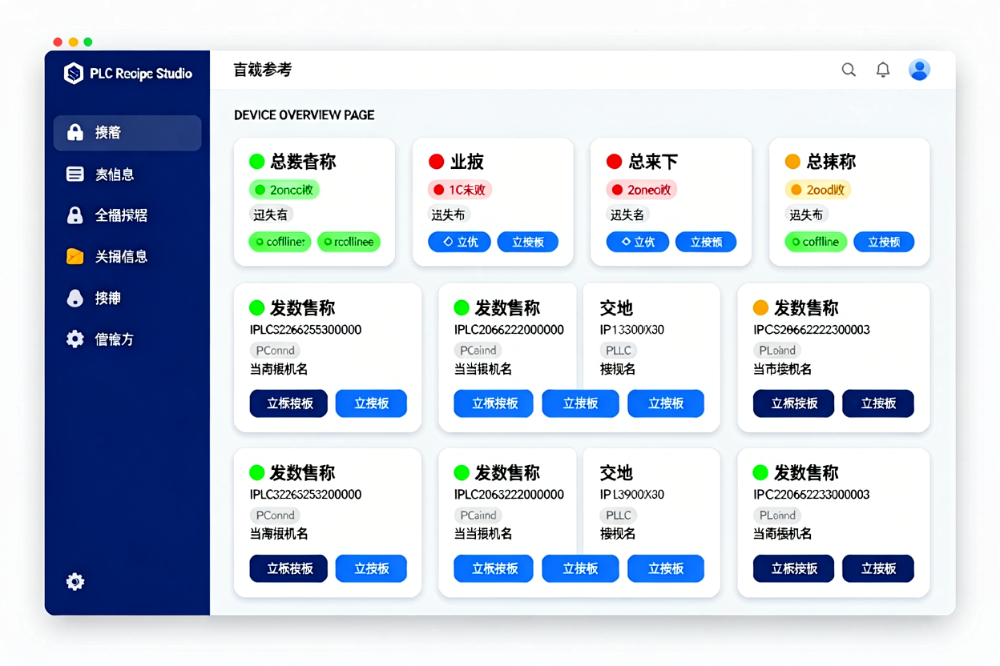

# PlcRecipeStudio

多品牌 PLC 配方管理与产线交互软件（WPF 桌面端 + 可选 API 宿主）。

**配方存储** = `Pfdoc\配方名.txt`（txt 即数据库，可直接记事本编辑；版本历史自存于 `Pfdoc\history\`）。
**设备/用户/操作日志** = 本地 SQLite（开箱即用，每日自动备份）；可切换 MySQL 作 MES 中央库。



## NuGet 单包使用

普通 .NET 项目只需安装一个包：

```bash
dotnet add package PlcRecipe --version 0.2.0
```

`PlcRecipe` 是 Core 与 Drivers 的单一程序集包，不依赖旧的 `PlcRecipe.Core` 或 `PlcRecipe.Drivers` 包；它只声明 `S7netplus` 和 `System.IO.Ports` 运行时依赖。已有项目升级时应移除旧包引用，避免重复类型。WPF 桌面应用本身请从源码构建或使用 GitHub Actions 发布的 Windows 构建产物，不作为普通 NuGet 库引用。


- **设备总览**：PLC 在线状态、卡片式连接/断开、信号联动地址配置、配方水印（在用版本回读核对）
- **配方管理**：新建/复制/重命名/删除、数据行编辑（上下限/备注）、Excel 导入导出、Excel 上传改动直接写 txt
- **上传下载**：多台并行下发（可配并行度）、下载前强制对比（可配）、下载后回读校验（可选优化：Bool/数值语义比较）
- **版本历史**：列表 → 差异比对 → 一键回滚（回滚本身也留档）
- **操作日志**：分手动/信号触发、按人/时间筛选、清理制度
- **安全**：角色（操作员/工程师/管理员，服务端守卫）、登录失败 5 次锁定 10 分钟、强制改密、密码 PBKDF2
- **主题**：亮/暗一键切换并保存；启动导入 PLC 已有配方（若 Pfdoc 为空且 DB 有存量）
- **API 宿主**：REST + SignalR（设备状态实时推送）——MES 集成入口（见下文）

### Pfdoc 配方文件格式

```
#PlcRecipeFile v1
Name=配方名
Device=设备名
Version=3
SavedAtUtc=2026-09-09T08:00:00.0000000Z
# 数据行格式: 名称|地址|类型|StringWords|值|下限|上限|单位|备注
温度|D100|Float32|8|25.0|10|80|℃|模温
启停|M0|Bool|8|1||||
```

手工编辑 txt 直接生效（无需重启软件，但如果正在编辑同一配方请注意保存顺序）。
同名 txt 全局唯一：重命名配比时不要与其它配方重名（软件会做哈希冲突检测）。

## 三、PLC 信号联动（PLC 主动发起）

| 信号 | 说明 |
|---|---|
| 配方名地址 | PLC 把配方名写入该区，软件按名字到 Pfdoc 找同名配方/更新/新建 |
| 下载请求位 | PLC 置位开始下载；完成后由 PLC 清零（握手闭环） |
| 上传请求位 | PLC 置位开始上传 |
| 完成/失败位 | 软件执行后写回；PLC 清请求位后软件复位 |
| 配方标识地址（水印） | 下载成功后写入 `配方名|v版本`，回读核对 |

多设备并发、单设备任务防重入、连接异常后看门狗自愈、超时由设置统一控制。

## 四、架构

```
PlcRecipeStudio/
├── PlcRecipe.Core               源码模块（由 PlcRecipe 包合并编译）
├── PlcRecipe.Drivers            源码模块（由 PlcRecipe 包合并编译）
├── PlcRecipe                    Core + Drivers 单一 NuGet 包（不依赖旧包）
├── PlcRecipe.Infrastructure     EF Core（SQLite/MySQL）+ 配方文件库 + 信号监视 + 备份 + 服务层
├── PlcRecipe.Server             ASP.NET Core API 宿主（REST + SignalR + 健康检查）
├── PlcRecipe.WpfApp             WPF UI（MVVM + HandyControl + 亮/暗双主题 + Generic Host DI）
├── PlcRecipe.Tests              175 项测试（含独立协议模拟器回环 + Pfdoc 集成）
├── PlcRecipe.StressTest         百万次循环实测器
├── docs/                        使用说明 + FINS 偏移验证文档 + 设计稿
└── scripts/deploy.cmd           一键发布（self-contained exe + 服务器 DLL）
```

**MVVM/异步纪律**：View 无业务层、ViewModel 不引用 UI 控件（手工桥接只租密码框）、命令走 RelayCommand、跨页消息用 WeakReferenceMessenger；批量下发 Parallel.ForEachAsync；文件写库全部原子（临时文件 + 原子替换）。

## 五、测试

```bash
dotnet test PlcRecipe.Tests   # 175 项：166 通过 + 9 跳过(待真机).
```

## 六、发布

根目录下：

```bash
scripts\deploy.cmd
```

NuGet 单包入口为 `PlcRecipe`，包含 Core 与 Drivers 的源码编译结果，仅声明 `S7netplus` 和 `System.IO.Ports` 依赖。已有项目若同时引用 `PlcRecipe.Core` 或 `PlcRecipe.Drivers`，升级时必须移除旧引用，避免重复类型。

产出 `publish\WpfApp\`（拷贝即用，无需安装 .NET）与 `publish\Server\`（dotnet 启动 MES 宿主）。

## 七、MES 升级路径（预留）

1. **切库**：系统管理 → 软件设置 → 数据库引擎选 MySQL + 填连接串 + 重启（配方文件库正文继续用，无中断）
2. **主机 API**：`dotnet run --project PlcRecipe.Server`（可选 HttpApiKey 鉴权），Rest/SignalR 可接入 MES 前端
3. **历史数据**：SQLite 里的设备/用户/日志保留不动；新数据自动入 MySQL；如要迁 SQLite→MySQL 数据可再咨询

## 八、注意事项

- **MC/FINS 为自实现协议**（已通过独立模拟器/HSL 对接测试），上真机前请开通 PLC 侧 MC 二进制通迅 / 欧姆龙 FINS 节点握手白名单
- 西门子需 PLC 属性里允许 PUT/GET 远程访问
- 配方文件中的 `StringWords`（一个汉字占 3 字节）按最长沙码填写
- 内置 admin 首次登录强制改密；连续 5 次失败锁定 10 分钟
- 本机 SQLite 与局域网 MySQL/TCP 不要同时运行（多写者会冲突；并存时建议用 MySQL）
- 自动化调试用：`PLCRECIPE_TEST_MYSQL` 环境变量可指向 MySQL 本机测试库；未达时相关用例自动跳过
